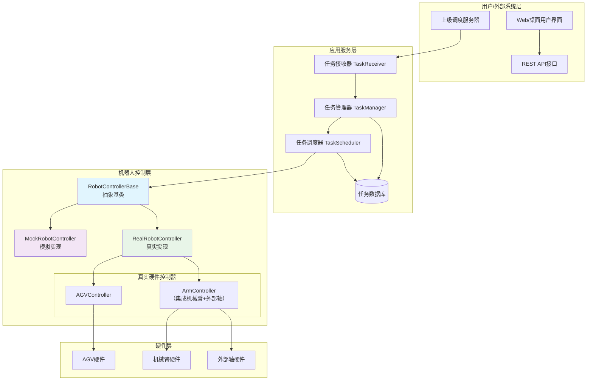
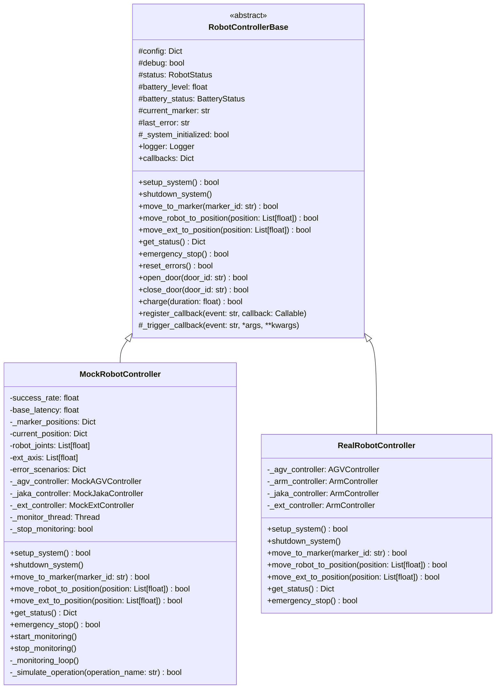
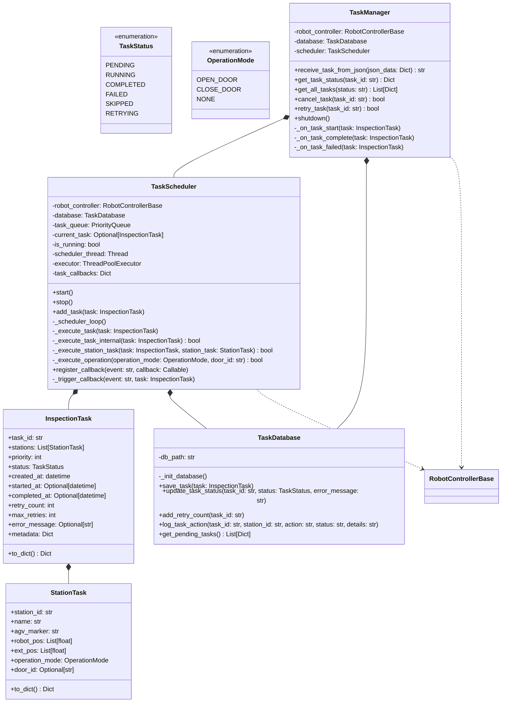
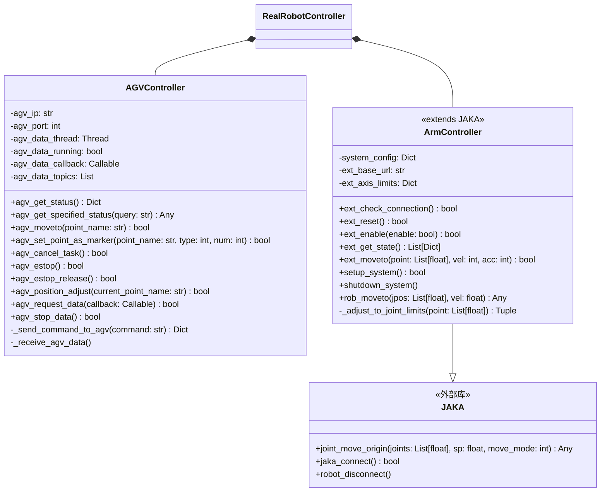
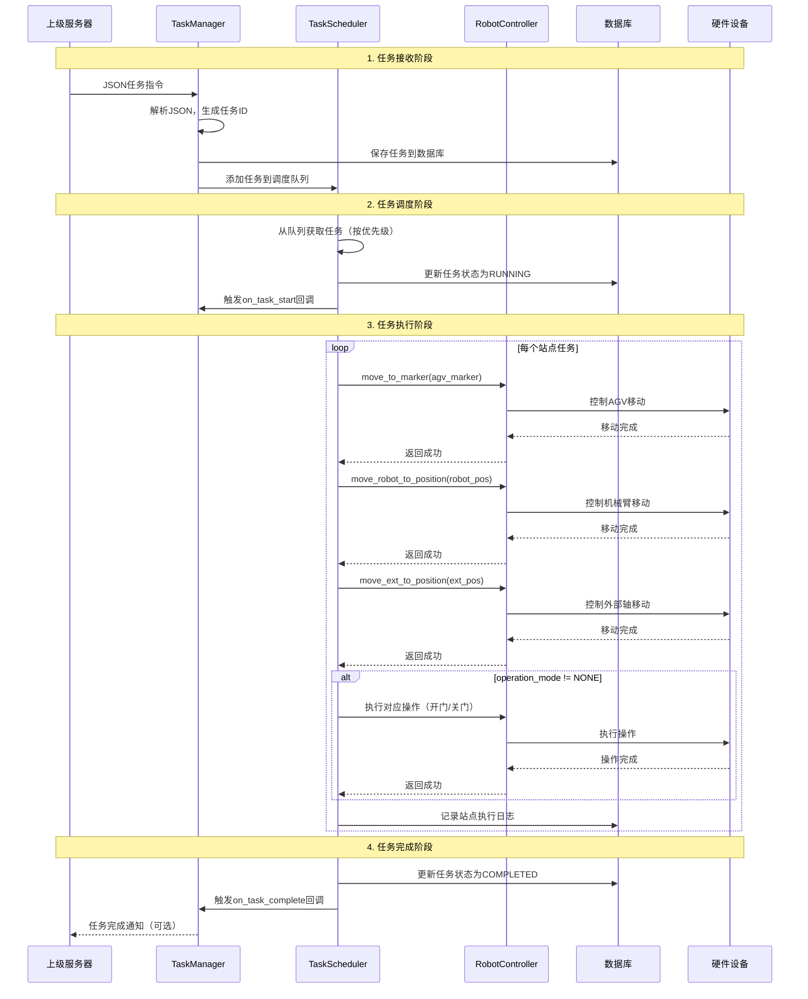

# DOCs
## 一、系统总体架构图


## 二、详细类图
### 2.1 核心类继承体系


### 2.2 任务管理系统类图



### 2.3 真实硬件控制器类图

## 三、系统架构说明
### 3.1 核心组件职责
| 组件                  | 职责              | 关键技术点                 |   
|---------------------|-----------------|-----------------------|
| TaskManager         | 任务接收、状态管理、历史查询  | JSON解析、任务ID生成、优先级计算   |   
| TaskScheduler       | 任务调度、执行监控、失败重试  | 优先级队列、线程池、状态机         |   
| TaskDatabase        | 任务持久化、执行历史记录    | SQLite数据库、JSON序列化     |   
| RobotControllerBase | 定义机器人控制标准接口     | 抽象基类、多态、回调机制          |   
| MockRobotController | 模拟机器人行为，用于开发和测试 | 随机成功率、延迟模拟、状态监控       |   
| RealRobotController | 控制真实机器人硬件       | TCP/IP通信、HTTP请求、错误处理  |   

### 3.2 数据流图


## 四、数据库设计
### 4.1 数据库表结构

```sql
-- 任务主表
CREATE TABLE tasks (
    task_id TEXT PRIMARY KEY,
    stations_json TEXT NOT NULL,           -- 任务站点信息（JSON格式）
    priority INTEGER DEFAULT 1,
    status TEXT DEFAULT 'pending',         -- pending/running/completed/failed/skipped/retrying
    created_at TIMESTAMP DEFAULT CURRENT_TIMESTAMP,
    started_at TIMESTAMP,
    completed_at TIMESTAMP,
    retry_count INTEGER DEFAULT 0,
    max_retries INTEGER DEFAULT 3,
    error_message TEXT,
    metadata_json TEXT DEFAULT '{}'
);

-- 任务执行历史表
CREATE TABLE task_history (
    id INTEGER PRIMARY KEY AUTOINCREMENT,
    task_id TEXT,
    station_id TEXT,                       -- 站点ID
    action TEXT,                           -- start/complete/error
    status TEXT,                           -- 执行状态
    timestamp TIMESTAMP DEFAULT CURRENT_TIMESTAMP,
    details TEXT,                          -- 详细执行信息
    FOREIGN KEY (task_id) REFERENCES tasks (task_id)
);

-- 系统配置表
CREATE TABLE system_config (
    config_key TEXT PRIMARY KEY,
    config_value TEXT,
    description TEXT,
    updated_at TIMESTAMP DEFAULT CURRENT_TIMESTAMP
);

-- 机器人状态历史表
CREATE TABLE robot_status_history (
    id INTEGER PRIMARY KEY AUTOINCREMENT,
    timestamp TIMESTAMP DEFAULT CURRENT_TIMESTAMP,
    status TEXT,                           -- idle/moving/operating/error/charging
    battery_level REAL,
    current_marker TEXT,
    agv_status_json TEXT,                  -- AGV详细状态（JSON）
    external_axis_status_json TEXT         -- 外部轴状态（JSON）
);

-- 创建索引
CREATE INDEX idx_tasks_status ON tasks(status);
CREATE INDEX idx_tasks_created ON tasks(created_at);
CREATE INDEX idx_task_history_task_id ON task_history(task_id);
CREATE INDEX idx_task_history_timestamp ON task_history(timestamp);
CREATE INDEX idx_robot_status_timestamp ON robot_status_history(timestamp);

```


### 4.2 数据模型关系
```text
tasks (1) ──────── (∞) task_history
    │
    ├── task_id (PK)
    ├── stations_json (包含多个StationTask)
    ├── status
    └── ...
    
task_history
    ├── task_id (FK → tasks.task_id)
    ├── station_id (对应stations_json中的某个站点)
    ├── action
    └── ...

```