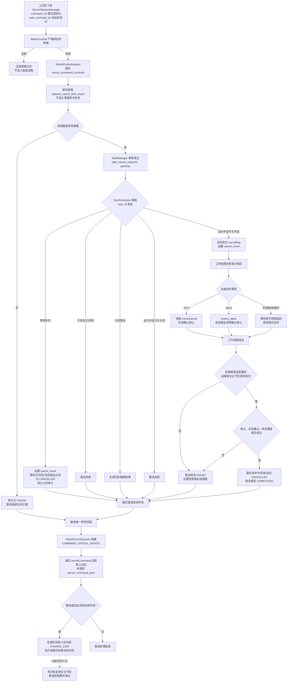
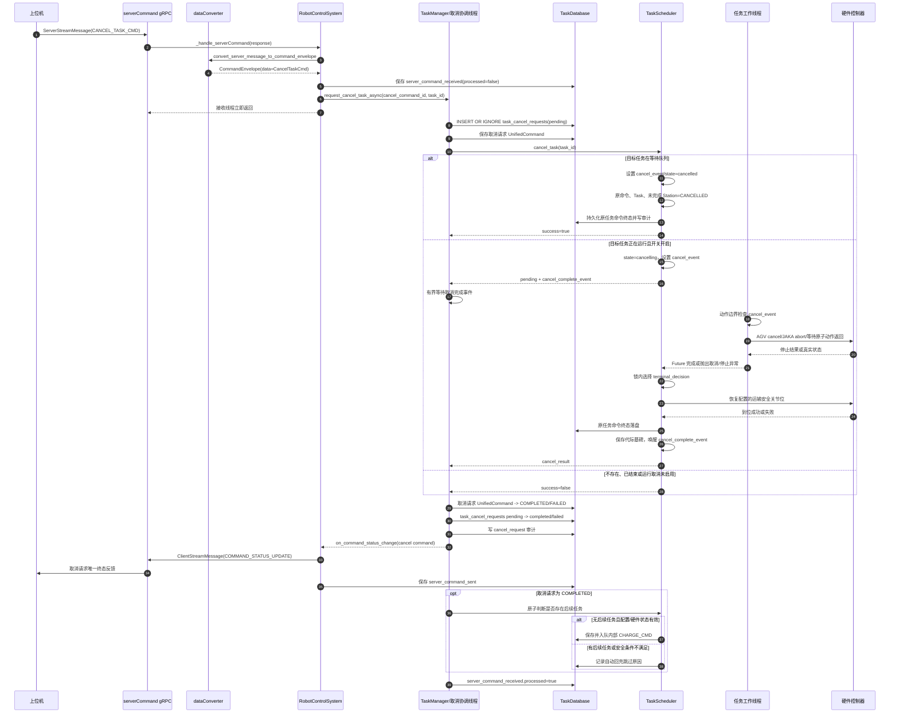
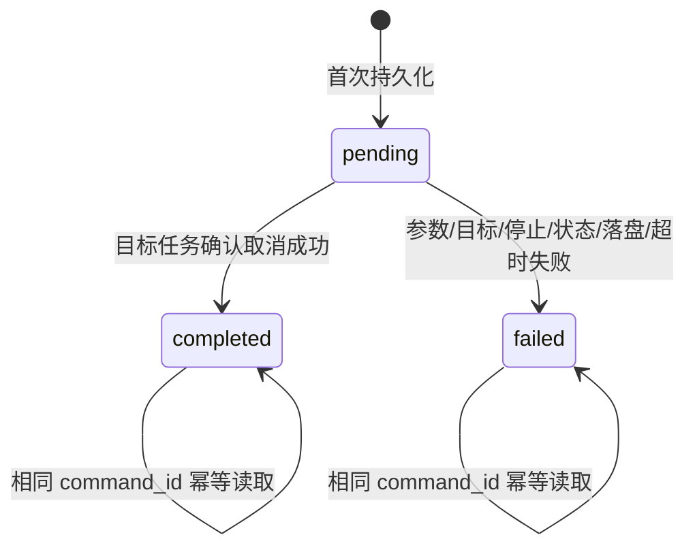
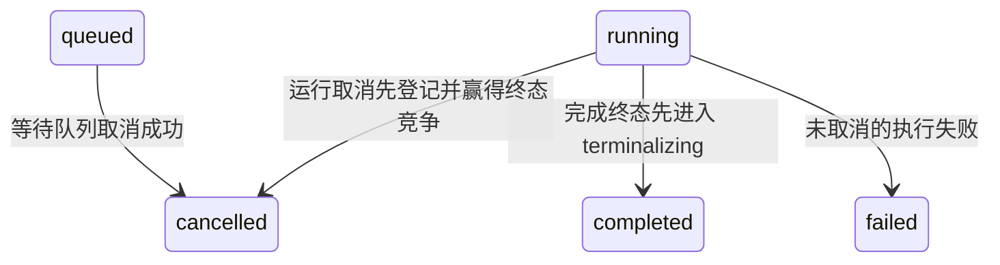
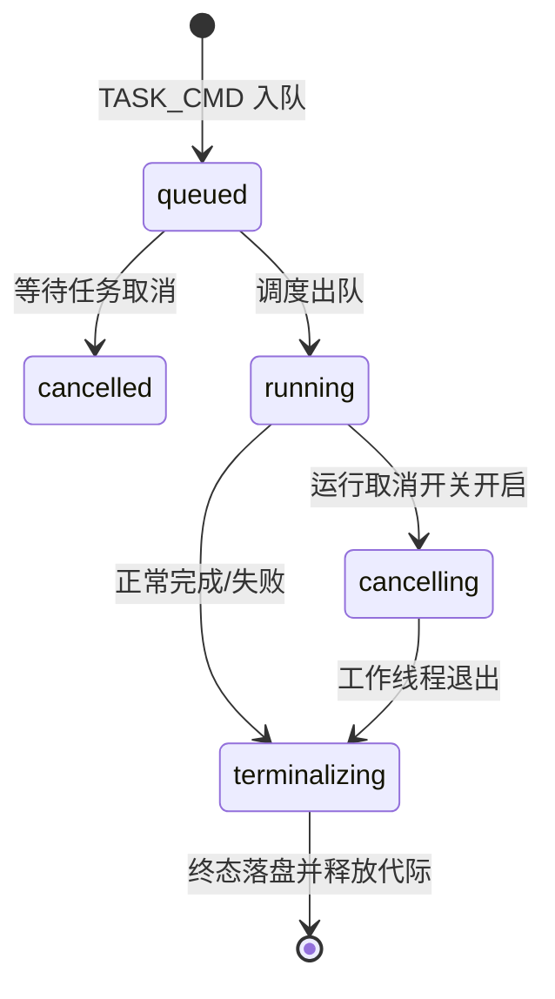

# 任务取消信息流与数据结构

> 编制日期：2026-09-01
> 依据：当前 `feat/ju` 分支代码、近期任务取消提交及《任务取消功能设计方案》
> 配套图：[`任务取消信息流与数据结构.drawio`](./任务取消信息流与数据结构.drawio)

## 1. 文档范围

本文描述机器人端**当前已经实现**的任务取消链路：从上位机通过 `serverCommand` 双向流下发 `CANCEL_TASK_CMD` 开始，经过协议解析、异步取消协调、调度器状态转换、硬件受控停止、安全姿态恢复和终态持久化，直到机器人向上位机发送唯一一次取消请求终态反馈；取消成功反馈提交后，再进行自动回充决策。

需要特别区分三类对象：

| 对象 | 标识 | 最终状态语义 |
|---|---|---|
| 取消请求 | 外层 `ServerStreamMessage.command_id` | 成功为 `COMPLETED`，失败为 `FAILED` |
| 被取消的原任务命令 | 原 `TASK_CMD.command_id` | 被取消后为 `CANCELLED` |
| 被取消的业务任务 | `task_cmd.task_id` | 当前进程内为 `TaskStatus.CANCELLED` |

取消请求自身不能标记为 `CANCELLED`。它是一条控制命令，其 `COMPLETED` 表示“取消操作成功”，`FAILED` 表示“取消操作失败”。

当前实现边界：

- 等待队列任务取消已实现；
- 运行任务协作取消及硬件受控停止代码已实现；
- 运行任务取消默认关闭，`task_cancel.allow_running_task_cancel` 缺省为 `false`；
- 固定安全关节位恢复、取消后低优先级自动回充以及新任务抢占已实现；
- 三份 `./conf` 配置均使用安全关节位 `[0,0,0,0,0,0]` 和充电点 `charge_point_1F_6010`；
- 运行取消尚未经过真实 AGV、JAKA 和外部轴现场验收。

## 2. 参与组件

| 组件 | 责任 |
|---|---|
| 上位机 | 生成取消请求 `command_id`，指定目标 `task_id`，接收最终反馈 |
| gRPC `serverCommand` 流 | 传输 `ServerStreamMessage` 和 `ClientStreamMessage` |
| `utils/dataConverter.py` | 协议映射、oneof 校验、机器人 ID 校验、构建内部取消模型 |
| `RobotControlSystem` | 保存接收记录、即时分流取消命令、发送最终反馈 |
| `TaskManager` | 取消请求幂等、异步协调、等待运行任务结束、提交取消请求终态 |
| `TaskScheduler` | 根据 `task_id` 定位活动任务、设置取消事件、线性化任务终态 |
| 任务工作线程 | 在动作边界检查 `cancel_event`，执行受控停止或完成原子动作 |
| 硬件控制器 | AGV 取消并确认停止；JAKA 中止并确认停止；外部轴完成原子动作后确认状态 |
| `TaskDatabase` | 保存接收消息、统一命令、取消请求结果、审计和发送记录 |

## 3. 总体信息流



## 4. 端到端时序



## 5. 逐步处理说明

### 5.1 上位机下发取消命令

上位机复用 `Task` 消息，只填写目标任务 ID：

```protobuf
ServerStreamMessage {
  command_id: <取消请求ID>
  command_time: <时间戳>
  command_type: CANCEL_TASK_CMD
  robot_id: <目标机器人ID>
  task_cmd {
    task_id: <被取消的业务任务ID>
  }
}
```

ID 语义：

```text
cancel command_id ──标识──> 本次取消请求、幂等、审计、反馈
target task_id     ──定位──> 当前进程内的活动业务任务
target command_id  ──标识──> 原始 TASK_CMD，由活动任务注册表间接获得
```

### 5.2 协议解析和校验

`convert_server_message_to_command_envelope()` 执行以下校验：

1. `command_type` 必须能映射为内部 `CmdType.CANCEL_TASK_CMD`；
2. `robot_id` 必须等于当前机器人 ID；
3. `WhichOneof("data_json")` 必须为 `task_cmd`；
4. `task_cmd.task_id` 必须大于 0；
5. 取消命令只转换目标 ID，不按完整任务解析。

转换结果：

```python
CommandEnvelope(
    cmd_id=str(server_message.command_id),
    cmd_time=int(server_message.command_time),
    cmd_type=CmdType.CANCEL_TASK_CMD,
    robot_id=server_message.robot_id,
    data_json={"cancel_task_cmd": {"task_id": task_id}},
    data=CancelTaskCmd(task_id=task_id),
)
```

校验失败时只记录拒绝日志，不创建取消请求，也不进入调度器。

### 5.3 RobotControlSystem 即时分流

`RobotControlSystem._handle_serverCommand()`：

1. 把接收消息保存到 `server_command_received`，初始 `processed=false`；
2. 触发通用的 `on_command_received` 回调；
3. 识别 `CANCEL_TASK_CMD`；
4. 调用 `request_cancel_task_async(cancel_command_id, task_id)`；
5. 立即返回，不调用普通 `receive_command()`，因此取消命令不进入 `PriorityQueue`，也不产生 `QUEUED`、`RUNNING` 中间反馈。

### 5.4 有界异步协调与幂等

`TaskManager.request_cancel_task_async()` 使用：

```python
_cancel_coordinator: ThreadPoolExecutor
_cancel_coordinator_slots: threading.BoundedSemaphore
_async_cancel_futures: dict[cancel_command_id, Future]
```

- 同一个 `cancel_command_id` 的并发投递复用同一个 `Future`；
- 默认 4 个协调 worker、容量 32；
- 容量耗尽时不无限排队，直接把本次取消请求收敛为 `FAILED`；
- 协调线程完成且形成持久化终态后，才把接收消息标记为 `processed=true`。

“唯一终态反馈”在当前实现中指同一进程内对同一个取消请求不发送 `QUEUED/RUNNING`，并对并发重复只触发一次终态回调。进程重启或断线重放后，机器人可以再次发送已经保存的同一终态，供上位机按 `command_id` 幂等接收。

`TaskManager.request_cancel_task()` 首先执行：

```sql
INSERT OR IGNORE INTO task_cancel_requests
    (cancel_command_id, target_task_id, status)
VALUES
    (?, ?, 'pending');
```

处理规则：

| 情况 | 处理 |
|---|---|
| 首次收到 `command_id` | 当前调用成为 owner，负责实际取消 |
| 相同 `command_id`、相同 `task_id` | 等待 owner 或读取已保存结果，不重复触碰硬件 |
| 相同 `command_id`、不同 `task_id` | 判定幂等冲突，不改写原绑定 |
| 重启遗留 `pending` | 无法证明硬件停止，按失败收敛 |
| 协调器过载 | 保存失败终态，避免无界堆积 |

### 5.5 调度器定位目标任务

`TaskScheduler` 使用活动任务注册表，不依赖数据库查询正在运行的线程：

```python
_active_tasks: dict[int, dict] = {
    task_id: {
        "command": UnifiedCommand,          # 原 TASK_CMD
        "cancel_event": threading.Event(),  # 协作取消令牌
        "state": "queued|running|cancelling|terminalizing|cancelled",
        "cancel_complete_event": threading.Event(),
        "cancel_result": dict | None,
    }
}
```

最近一个已取消任务代际保存在：

```python
_cancelled_task_generations: dict[int, dict] = {
    task_id: {
        "success": bool,
        "message": str,
        "target_command_id": str,
    }
}
```

### 5.6 等待队列任务取消

在 `_task_registry_lock` 保护下：

1. 设置 `cancel_event`；
2. `entry.state = "cancelled"`；
3. 原 `TASK_CMD` 的 `UnifiedCommand.status = CANCELLED`；
4. `Task.status = CANCELLED`；
5. 除已完成站点外（包括历史 `FAILED` 站点）统一设为 `StationTaskStatus.CANCELLED`；
6. 持久化原任务命令终态；
7. 写 `cancel_waiting_task` 审计；
8. 返回取消成功。

任务对象仍可暂时留在 `PriorityQueue` 中。后续出队时 `_execute_command()` 再次检查注册表、取消事件和命令终态并直接丢弃，保证不会调用硬件。

### 5.7 运行任务取消

运行取消首先检查功能开关：

```text
task_cancel.allow_running_task_cancel = false（默认）
```

关闭时直接返回失败，不设置取消事件。开启时：

1. `entry.state` 改为 `cancelling`；
2. 设置共享 `cancel_event`；
3. 返回 `pending + cancel_complete_event + entry`；
4. 取消协调线程最多等待 `task_cancel.wait_timeout_seconds`，默认 30 秒；
5. 任务线程在站点、重试、AGV、外部轴、机械臂、操作和复位边界检查事件；
6. 工作线程退出后，调度器将机械臂恢复到配置的 `[0,0,0,0,0,0]`，到位成功才允许取消请求成功。

如果协调等待超时，当前取消请求先按 `FAILED` 形成终态；任务工作线程仍持有当前调度执行权，并继续响应已经设置的 `cancel_event`，直到真正退出。超时不能被解释为硬件已经停止，也不会提前放行下一任务。

硬件行为：

| 动作 | 当前取消方式 | 完成条件 |
|---|---|---|
| AGV 移动 | `/api/move/cancel` | 轮询到 `idle/canceled/cancelled/canceld/succeeded/failed` |
| JAKA 运动 | 非阻塞 `joint_move` 后调用 `motion_abort()` | 关节位置连续稳定采样 |
| 外部轴 `/moveto` | 不强行中断，等待原子请求返回 | `/status` 可解析；目标位置是否到达另行判断 |
| 开关门、拍照、服务 | 当前调用完成后停止 | 返回后的取消检查点 |

如果硬件停止或真实状态无法确认，抛出 `ControlledStopError`。调度器将：

- 保持原任务为 `CANCELLED`（取消请求已经先赢得终态竞争）；
- 把取消请求结果设为失败；
- 设置 `_hardware_fault_blocked=true`；
- 禁止调度下一条硬件命令，等待人工确认和恢复；
- 运维入口为上位机依次下发机器人硬件关闭、机器人硬件启动；只有 `setup_system()` 重新初始化成功才调用 `clear_hardware_fault_block()`。

### 5.8 任务终态线性化

任务 `Future` 完成后，`_command_execution_done()` 在 `_task_registry_lock` 内选择唯一终态：

```text
cancel_event 已设置                    -> CANCELLED
没有取消、执行成功且无异常             -> COMPLETED
其他情况                               -> FAILED
```

一旦 `entry.state = "terminalizing"`，后到的取消请求不再覆盖已经开始提交的完成/失败终态。

运行取消终态处理顺序：

1. 机械臂恢复并确认到达配置的运输安全关节位；
2. 更新原 `UnifiedCommand`、`Task` 和站点内存状态；
3. 持久化原任务命令 `CANCELLED`；
4. 形成 `cancel_result` 并保存 `_cancelled_task_generations` 代际墓碑；
5. 从 `_active_tasks` 释放当前代际；
6. 设置 `cancel_complete_event` 唤醒取消协调线程；
7. 调度器随后才能释放 `current_command` 并处理下一条命令。

当前代码不会向上位机额外反馈原 `TASK_CMD` 的 `CANCELLED` 状态。

### 5.9 取消请求终态提交

`TaskManager` 根据调度结果设置取消命令：

```text
result.success = true  -> Cancel UnifiedCommand.status = COMPLETED
result.success = false -> Cancel UnifiedCommand.status = FAILED
```

随后按顺序处理：

1. 更新 `unified_commands` 中取消请求命令的终态；
2. 条件更新 `task_cancel_requests`：仅允许 `pending -> completed/failed`；
3. 写 `cancel_request` 审计日志；
4. 触发一次 `on_command_status_change`，先向上位机提交唯一终态反馈；
5. 取消成功时，在调度锁内检查后续任务；无后续任务则持久化并入队一个优先级为 9 的内部 `CHARGE_CMD`；
6. 唤醒相同 `cancel_command_id` 的进程内等待者；
7. 异步协调函数把接收记录设为 `processed=true`。

如果取消请求关键终态未落盘，不发送成功反馈，并保留接收消息未处理，等待重发。

### 5.10 向上位机反馈

机器人通过同一个 `serverCommand` 双向流发送：

```protobuf
ClientStreamMessage {
  command_id: <取消请求ID>
  command_time: <发送时间>
  command_type: COMMAND_STATUS_UPDATE
  robot_id: <机器人ID>
  command_status {
    command_id: <取消请求ID>
    command_type: CANCEL_TASK_CMD
    status: COMMAND_STATUS_COMPLETED | COMMAND_STATUS_FAILED
    message: <状态消息>
    timestamp: <发送时间>
    retry_count: 0
  }
}
```

反馈使用的是**取消请求 ID**，不是原任务命令 ID，也不是业务 `task_id`。

同一条反馈的外层 `command_time` 与内层 `timestamp` 使用同一个毫秒发送时间。

上位机以 `status` 判断取消成功或失败，处理逻辑与其他命令反馈一致。`message` 允许携带机器人端的详细状态或失败原因；上位机可按需展示或解析，但不能用字符串替代枚举状态判断。

发送后还会在 `server_command_sent` 中保存一条 `COMMAND_STATUS_UPDATE` 记录。流不可用时，消息进入现有离线缓存/重发路径。

## 6. 核心数据结构

### 6.1 协议层

| 数据结构 | 关键字段 | 用途 |
|---|---|---|
| `ServerStreamMessage` | `command_id`, `command_type`, `robot_id`, `task_cmd` | 上位机下发取消请求 |
| `Task`（协议消息） | `task_id` | 取消协议中只作为目标任务 ID 容器 |
| `ClientStreamMessage` | `command_id`, `command_type=COMMAND_STATUS_UPDATE`, `command_status` | 机器人反馈取消终态 |
| `CommandStatusUpdate` | `command_id`, `command_type=CANCEL_TASK_CMD`, `status`, `message` | 取消结果载荷 |

### 6.2 内部模型

```python
@dataclass
class CancelTaskCmd:
    task_id: int
```

```python
@dataclass
class CommandEnvelope:
    cmd_id: str
    cmd_time: int
    cmd_type: CmdType
    robot_id: int
    data_json: dict
    data: Any
```

```python
@dataclass
class UnifiedCommand:
    command_id: str
    cmd_type: CmdType
    category: CommandCategory
    priority: int
    data: Any
    status: CommandStatus
    created_at: datetime
    started_at: datetime | None
    completed_at: datetime | None
    retry_count: int
    max_retries: int
    error_message: str | None
    metadata: dict
```

取消请求 `UnifiedCommand` 的固定属性：

```text
cmd_type = CANCEL_TASK_CMD
category = CONTROL
priority = 0（仅表示控制面优先级；该命令实际不进入普通队列）
data = CancelTaskCmd(task_id=<目标任务ID>)
metadata.target_task_id = <目标任务ID>
```

取消成功且无后续任务时，调度器生成的内部自动回充命令结构为：

```text
UnifiedCommand {
  command_id: "auto-charge-after-cancel:<原TASK_CMD command_id>"
  cmd_type: CHARGE_CMD
  category: CONTROL
  priority: 9
  data: {"charge": true}
  status: QUEUED
  metadata: {
    internal: true
    source: "auto_charge_after_task_cancel"
    cancelled_task_id: <目标task_id>
    cancel_command_id: <取消请求ID>
    task_enqueue_generation: <生成时任务入队代际>
    charge_marker: <配置的充电点>
  }
}
```

`task_enqueue_generation` 用于执行前的第二次竞态检查；运行中的内部回充命令还携带只存在于内存中的 `threading.Event cancel_event`，新任务到达时通过该事件请求 AGV 受控停止。内部命令不触发上位机命令状态回调，只保存本地命令终态和审计。

### 6.3 业务任务内存模型

| 模型 | 取消相关字段 |
|---|---|
| `Task` | `task_id`, `status`, `station_list`, `completed_at`, `error_message` |
| `Station` | `status`, `execution_phase`, `completed_at`, `error_message` |
| `TaskStatus` | 新取消流程使用 `CANCELLED="cancelled"` |
| `StationTaskStatus` | 新取消流程使用 `CANCELLED="cancelled"` |

### 6.4 数据库表

#### `server_command_received`

| 字段 | 含义 |
|---|---|
| `msg_id` | 取消请求 `command_id` |
| `msg_time` | 上位机命令时间 |
| `cmd_type` | `cancel_task_cmd` |
| `robot_id` | 目标机器人 |
| `data_json` | 内部转换后的取消载荷 |
| `processed` | 是否已形成可持久化处理结果 |

#### `task_cancel_requests`

| 字段 | 含义 |
|---|---|
| `cancel_command_id` | 主键；取消请求幂等键 |
| `target_task_id` | 被取消业务任务 ID |
| `status` | `pending/completed/failed` |
| `message` | 本地详细结果 |
| `created_at` | 请求登记时间 |
| `completed_at` | 终态时间 |

#### `unified_commands`

同时保存：

- 原始 `TASK_CMD`：状态从 `queued/running` 进入 `cancelled`；
- 取消 `CANCEL_TASK_CMD`：状态从 `pending` 进入 `completed/failed`。

#### `task_history`

当前涉及的审计动作包括：

- `cancel_waiting_task`；
- `cancel_request`；
- `cancel_request_conflict`；
- `recover_pending_cancel`。

#### `server_command_sent`

保存向上位机发送的 `COMMAND_STATUS_UPDATE`，其中 `command_id` 仍是取消请求 ID。

## 7. 状态转换

### 7.1 取消请求命令



### 7.2 原任务命令



### 7.3 活动任务注册表



## 8. 结果矩阵

| 目标任务状态 | 原任务命令 | 取消请求反馈 | 硬件行为 |
|---|---|---|---|
| 等待中 | `CANCELLED` | `COMPLETED` | 不调用硬件 |
| 运行中、开关关闭 | 保持 `RUNNING` | `FAILED` | 不设置取消事件 |
| 运行中、受控停止成功 | `CANCELLED` | `COMPLETED` | 停止或完成原子动作后退出 |
| 运行中、停止/状态确认失败 | `CANCELLED` | `FAILED` | 阻塞后续调度 |
| 已取消代际 | 保持 `CANCELLED` | 复用原取消结果 | 不重复停止硬件 |
| 已完成/已失败/不存在 | 保持原状态 | `FAILED` | 不操作硬件 |
| 协调器过载 | 保持原状态 | `FAILED` | 未进入取消执行 |
| 取消结果落盘前进程中断 | 无法证明 | 重启后 `FAILED` | 不凭空判定成功 |

## 9. 锁、线程和一致性边界

| 机制 | 保护对象 | 关键作用 |
|---|---|---|
| gRPC 接收线程 | 协议接收 | 只解析、保存和提交异步取消，不等待硬件 |
| `_cancel_request_lock` | 同一取消 `command_id` | owner/等待者选择、Future 去重、反馈去重 |
| `_cancel_coordinator_slots` | 协调任务容量 | 防止大量取消请求无界堆积 |
| `_task_registry_lock` | 活动任务代际和终态 | 防止出队/取消、完成/取消相互覆盖 |
| `cancel_event` | 调度器到工作线程/硬件 | 线程安全协作取消信号 |
| `cancel_complete_event` | 工作线程到协调线程 | 表示运行任务取消已经形成结果 |
| SQLite 条件更新 | 取消请求终态 | 仅一个执行者可提交 `pending -> terminal` |

## 10. 部署前剩余验证边界

| 项目 | 当前实现 | 部署/启用条件 |
|---|---|---|
| 运行取消开关 | 默认关闭 | 真机验收后灰度开启 |
| 固定安全姿态 | 已配置并实现恢复到 `[0,0,0,0,0,0]` | 真机确认运动路径和到位结果 |
| 运输安全检查 | 安全关节位恢复成功后才允许回充 | 真机确认该姿态与现场外部轴位置组合允许 AGV 移动 |
| 自动回充 | 已实现内部低优先级命令、生成/执行双检查和新任务受控抢占 | 真机确认充电点和回充中断策略 |
| 反馈 `message` | 携带详细原因 | 上位机以 `status` 为主判断，`message` 按需解析 |
| 历史失败站点 | 除 `COMPLETED` 外统一覆盖为 `CANCELLED` | 已按本轮业务规则确认 |
| 硬件验证 | Mock | 真实 AGV/JAKA/外部轴现场验证 |
| 故障解除 | 硬件关闭→硬件启动，重新初始化成功后解除阻塞 | 真机验证该运维步骤和日志 |

代码链路现已覆盖“受控停止 → 安全姿态 → 取消成功 → 无后续任务时自动回充”。上线状态仍为**待真机验证**，运行中取消开关在验证完成前保持关闭。

## 11. 代码索引

| 处理环节 | 代码位置 |
|---|---|
| Proto 定义 | `gRPC/proto/RobotService.proto` |
| 协议转换与校验 | `utils/dataConverter.py::convert_server_message_to_command_envelope` |
| 接收和即时分流 | `RobotControlSystem.py::_handle_serverCommand` |
| 取消异步协调 | `task/TaskManager.py::request_cancel_task_async` |
| 幂等和取消请求终态 | `task/TaskManager.py::request_cancel_task` |
| 活动任务取消 | `task/TaskScheduler.py::cancel_task` |
| 任务终态线性化 | `task/TaskScheduler.py::_command_execution_done` |
| 运行取消最终处理 | `task/TaskScheduler.py::_finalize_task_terminal` |
| 安全姿态恢复 | `task/TaskScheduler.py::_recover_transport_safe_pose`、`robot/RobotController.py::recover_transport_safe_pose` |
| 自动回充决策 | `task/TaskScheduler.py::schedule_auto_charge_after_cancel` |
| 回充执行前复检 | `task/TaskScheduler.py::_auto_charge_skip_reason_locked` |
| 故障恢复入口 | `task/TaskManager.py::start_hardware`、`task/TaskScheduler.py::clear_hardware_fault_block` |
| 取消检查点 | `task/TaskScheduler.py::_raise_if_task_cancelled` |
| AGV 取消 | `robot/AGVController.py::agv_cancel_task` |
| JAKA 中止 | `robot/ArmController.py::rob_moveto`、`robot/jaka.py::motion_abort_origin` |
| 外部轴原子动作 | `robot/ArmController.py::ext_moveto` |
| 数据库幂等记录 | `task/TaskDatabase.py::begin_task_cancel_request` |
| 最终反馈 | `RobotControlSystem.py::_send_command_status_update` |

## 12. 机器人本体部署前清单（2026-09-01）

### 12.1 任何生产部署前

| 项目 | 当前状态 | 说明 |
|---|---|---|
| 取消反馈数据结构 | 代码已具备 | 外层/内层均使用取消请求 ID，类型为 `COMMAND_STATUS_UPDATE / CANCEL_TASK_CMD`，上位机以 `status` 为主判断，`message` 可含详情 |
| 上位机联调 | 暂缓 | 在本地修改和机器人适配全部结束后进行 |
| 自动化测试复跑 | 本轮暂缓 | 按当前安排未执行；仅完成 Python 语法、JSON、draw.io XML 和 diff 静态校验 |
| 数据库升级验证/既有提交/独立审查 | 按项目口径完成 | 本轮未改数据库结构；注意本轮新增代码仍是工作区改动，尚未创建新提交 |
| 三份发布配置 | 已完成 | `config.json`、`config_local.json`、`config_mm.json` 已同步增加 `task_cancel` 和 `charging` |

### 12.2 启用运行中任务取消前

| 项目 | 当前状态 | 说明 |
|---|---|---|
| 安全关节位置 | 代码与配置完成 | 三份配置均为 `[0,0,0,0,0,0]`；运行取消成功前必须恢复到位 |
| AGV 运行中取消 | 待真机 | 验证取消接口、停止状态枚举、停止超时和异常路径 |
| JAKA/外部轴取消边界 | 待真机 | 验证 `motion_abort()`、停止确认、外部轴原子动作返回和真实状态 |
| 故障恢复入口 | 代码完成，待真机 | 上位机先关闭机器人硬件，再启动机器人硬件；只有重新初始化成功才解除调度阻塞 |
| 历史站点状态 | 已完成 | 除 `COMPLETED` 外，历史 `FAILED` 也允许覆盖为 `CANCELLED` |
| 运行取消开关 | 保持关闭 | 真机验收通过前 `allow_running_task_cancel=false` |

### 12.3 完整需求上线前：自动回充

| 项目 | 当前状态 | 说明 |
|---|---|---|
| 充电点配置 | 已完成 | 三份配置均为 `charge_point_1F_6010` |
| 无后续任务时回充 | 代码完成 | 取消终态提交后生成优先级 9 的内部 `CHARGE_CMD` |
| 有后续任务时不回充 | 代码完成 | 继续执行下一任务，不生成本次回充 |
| 新任务与回充竞态 | 代码完成 | 生成时/执行前双检查；回充移动中收到任务时受控停止 |
| 自动回充真机验收 | 待真机 | 验证安全姿态、充电点、AGV到桩和回充中断策略 |

结论：机器人端代码和配置已进入“可开始真机验收”的状态，但在真机用例通过且生产开关打开前，不能标记为生产上线完成。
